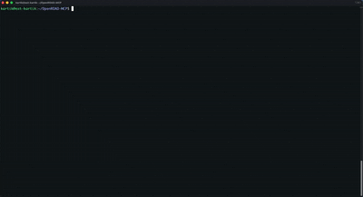

# OpenROAD MCP Server

<!-- mcp-name: io.github.The-OpenROAD-Project/openroad-mcp -->

A Model Context Protocol (MCP) server that provides tools for interacting with [OpenROAD](https://theopenroadproject.org/) and [ORFS](https://github.com/The-OpenROAD-Project/OpenROAD-flow-scripts).

## About OpenROAD MCP

**New here?** Check out the [Quick Start Guide](docs/QUICKSTART.md) to get your AI assistant analyzing designs in 5 minutes.

OpenROAD MCP eliminates the barrier between your AI assistant and physical design by connecting Claude, Cursor, and other MCP-compatible clients directly to the OpenROAD layout tools.

OpenROAD is the leading open-source, foundational application for semiconductor digital design, delivering an Autonomous, No-Human-In-Loop (NHIL) flow from RTL-GDSII. OpenROAD-flow-scripts (ORFS) is the fully autonomous flow built around it.

With this MCP server, your AI assistant can:
- **Execute Commands** - Run interactive OpenROAD sessions with full PTY support.
- **Manage Sessions** - Create, list, inspect, and terminate multiple physical design sessions.
- **Track History & Metrics** - Access full command history and performance metrics for analysis.
- **Visualize Reports** - List and read report images from ORFS runs directly in the chat.

## Demo



[Watch full demo video](https://youtu.be/1J-Qtto-ssU)

## Requirements & Installation

To use this MCP server, you need the server runtime, plus the underlying OpenROAD layout tools.

### 1. Server Runtime
- **Node.js 22+** is required to run the `npx` distribution.

### 2. OpenROAD
**OpenROAD** must be installed and available in your `PATH`.
- [Official OpenROAD Installation Guide](https://openroad.readthedocs.io/en/latest/user/Build.html)

### 3. OpenROAD-flow-scripts (ORFS)
**ORFS** is optional but highly recommended for complete RTL-to-GDS flows and report visualization.
- [Official ORFS Local Build Guide](https://openroad-flow-scripts.readthedocs.io/en/latest/user/BuildLocally.html)

## Configuration

For platform-specific Node.js and C++ toolchain setup instructions, see the **[Cross-Platform Build Guide](docs/CROSS_PLATFORM.md)**.

You do **not** need to clone this repo or pass path environment variables in the common case. The published `npx` package does not read a `.env` file.

On startup the server inherits the MCP client's environment, then fills `PATH` the same way `which openroad` would: current `PATH`, then your login-shell `PATH`, then common install locations (`/opt/homebrew/bin`, conda, local OpenROAD builds). `ORFS_FLOW_PATH` defaults to `~/OpenROAD-flow-scripts/flow`, and is also detected when ORFS sits next to the `openroad` binary.

## Supported MCP Clients

Here is the standard base configuration used across most clients:

```json
{
  "command": "npx",
  "args": ["-y", "openroad-mcp"]
}
```

Find your specific client below for the exact configuration snippet and file location.

<details><summary><b>Claude Code</b></summary>

```bash
claude mcp add --transport stdio openroad-mcp -- npx -y openroad-mcp
```

Or add the standard config to `.mcp.json` / `.claude/settings.json`.

If a GUI-launched client still cannot find `openroad`, pass an override. Use `command -v` so you do not hard-code paths:

```bash
claude mcp add \
  --env PATH="$(dirname "$(command -v openroad)"):${PATH}" \
  --env ORFS_FLOW_PATH="${HOME}/OpenROAD-flow-scripts/flow" \
  --transport stdio openroad-mcp \
  -- npx -y openroad-mcp
```

Put `--transport` between `--env` and the server name so the CLI does not treat the name as another `KEY=value` pair.
</details>

<details><summary><b>Claude Desktop</b></summary>

Add the standard config to:
- **macOS**: `~/Library/Application Support/Claude/claude_desktop_config.json`
- **Windows**: `%APPDATA%\Claude\claude_desktop_config.json`
</details>

<details><summary><b>Cursor</b></summary>

Add the standard config to `.cursor/mcp.json`.
</details>

<details><summary><b>GitHub Copilot (VS Code)</b></summary>

Add to `.vscode/mcp.json`. Requires `"type": "stdio"`:
```json
{
  "servers": {
    "openroad-mcp": {
      "type": "stdio",
      "command": "npx",
      "args": ["-y", "openroad-mcp"]
    }
  }
}
```
</details>

<details><summary><b>Windsurf</b></summary>

Add the standard config to `~/.codeium/windsurf/mcp_config.json`.
</details>

<details><summary><b>Cline / Roo Code</b></summary>

Add the standard config to `cline_mcp_settings.json` (Cline) or `.roo/mcp.json` (Roo Code).
</details>

<details><summary><b>Continue / PearAI</b></summary>

Add to your respective `config.json` under `modelContextProtocolServers`:
```json
{
  "transport": {
    "type": "stdio",
    "command": "npx",
    "args": ["-y", "openroad-mcp"]
  }
}
```
</details>

<details><summary><b>Zed</b></summary>

Add to `~/.config/zed/settings.json`:
```json
{
  "context_servers": {
    "openroad-mcp": {
      "command": {
        "path": "npx",
        "args": ["-y", "openroad-mcp"]
      }
    }
  }
}
```
</details>

<details><summary><b>Docker / MCP Registry / Others</b></summary>

The server is available on the [MCP Registry](https://registry.modelcontextprotocol.io) and via Docker:
```bash
docker run --rm -i ghcr.io/the-openroad-project/openroad-mcp:latest
```
Most other standard STDIO clients are fully supported. Refer to your tool's MCP setup guide.
</details>

## Available Tools

Once configured, your AI assistant will have access to the following tools. For detailed parameters, schemas, and return formats, see the **[API Reference](docs/API.md)**.

- `interactive_openroad_query`
- `interactive_openroad_exec`
- `create_interactive_session`
- `list_interactive_sessions`
- `terminate_interactive_session`
- `inspect_interactive_session`
- `get_session_history`
- `get_session_metrics`
- `list_report_images`
- `read_report_image`

## Troubleshooting

- **The server fails to start**: Ensure you have Node.js 22+. Older versions will fail.
- **Session creation fails**: Confirm `command -v openroad` works in a terminal. The server inherits PATH and searches common install locations; if your prefix is unusual, pass `PATH` with `--env` as shown in the Claude Code section.
- **Commands rejected with CommandBlocked**: You sent a state-modifying command to `interactive_openroad_query`. Use `interactive_openroad_exec` instead.
- **Report images not found**: The server defaults to `~/OpenROAD-flow-scripts/flow`. If ORFS lives elsewhere, set `ORFS_FLOW_PATH` in the MCP client's `env` block (not a `.env` file).

To get more detail, set `LOG_LEVEL=DEBUG` in the server's environment.

## Development

Clone the repository. `.env.example` is a local-dev reference only; copy it to `.env` if you use direnv or similar. The server still reads `process.env` (the MCP client's `env` block), not the file.

Then run:
```bash
cd typescript
npm install
npm run build
```

**Testing:**
```bash
npm run test             # unit tests
npm run test:integration # integration tests
npm run test:performance # performance benchmarks
```

**Linting & type checking:**
```bash
npm run typecheck
npm run lint
```

## Contributing

We welcome contributions! Please see [CONTRIBUTING.md](CONTRIBUTING.md) for detailed instructions on our development workflow and code standards.

## License

BSD 3-Clause License. See [LICENSE](LICENSE) file.

---
*Built with ❤️ by Precision Innovations*